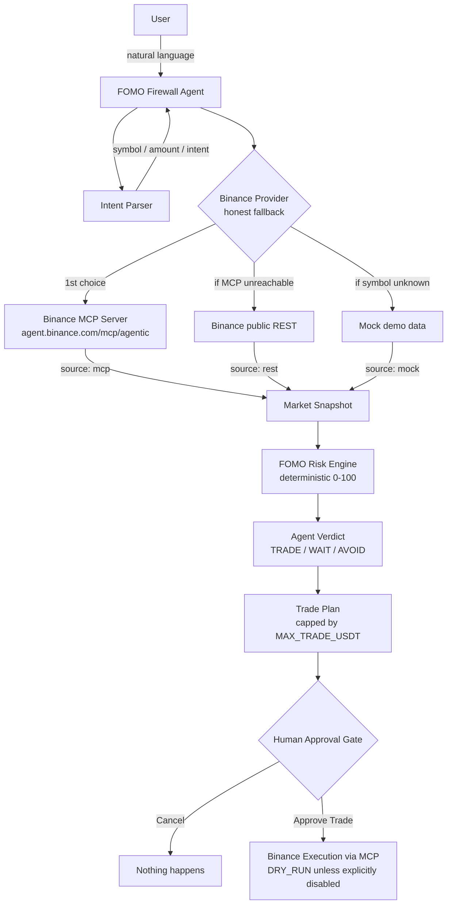

# FOMO Firewall

**Binance Agent OS Mini Hackathon — Track A**

**An AI trading agent that stops you from chasing pumps.**

> Crypto traders don't need another signal bot. They need an agent that knows when *not* to trade.
>
> FOMO Firewall analyzes live Binance market conditions, challenges impulsive trades, and only executes after human approval.

---

## Problem

The most expensive behavior in crypto isn't bad analysis — it's FOMO:

- *"This coin just pumped 20%, can I still get in?"*
- *"BNB is suddenly up, I want to throw 50 USDT at it."*
- *"Is this thing about to moon? Check it for me."*

Most trading bots answer **"What should I buy?"** — and happily help users enter the worst possible trades at the worst possible moment.

## Solution

FOMO Firewall answers a different question: **"Should I trade this right now?"**

It is an agent-first product. The user talks to an AI agent in natural language. The agent fetches real market data from Binance, runs a deterministic FOMO Risk Engine, explains the result in plain language, and — only if risk is acceptable — prepares a trade plan that the **human must explicitly approve** before anything executes.

## Why FOMO Firewall

- **It says no.** Most bots help you enter trades. FOMO Firewall knows when to stop you.
- **The score is real.** The FOMO Score is a deterministic, auditable algorithm — not an LLM hallucination. Every point is traceable to a factor with a raw value and a reason.
- **The human keeps control.** No order executes without an explicit click on "Approve Trade". Ever.
- **Honest modes.** DEMO DATA is clearly labeled. DRY RUN is the default. Live trading requires deliberate opt-in.

## How It Works

1. The user types natural language into the Agent Chat: *"PONS just pumped 20%. Should I chase it with 50 USDT?"*
2. The Intent Parser extracts `{ intent, symbol, amount, requiresTrade }` deterministically.
3. The agent pulls a normalized market snapshot from the Binance Provider (price, klines, order book, volume, VWAP, spread, volatility).
4. The FOMO Risk Engine scores the snapshot across 6 weighted factors → **0–100**.
5. The agent issues a verdict — **TRADE / WAIT / AVOID** — with a human-readable explanation and a suggested action.
6. If the user wanted to trade and the verdict allows it, a Trade Plan is generated (capped by `MAX_TRADE_USDT`).
7. The **Human Approval Gate** shows a REVIEW ORDER card. Only clicking **Approve Trade** calls execution — and `DRY_RUN=true` keeps it simulated.

## Architecture



Layers are strictly separated:

| Layer | Responsibility | Files |
| --- | --- | --- |
| Data Layer | Market data & execution behind one interface | `src/binance/*` |
| Risk Engine | Deterministic FOMO scoring, zero LLM involvement | `src/scoring/*` |
| Agent Reasoning | Intent parsing, verdict, explanation, trade plan | `src/agent/*` |
| Execution Layer | Approval-gated, dry-run-first order execution | `src/app/api/execute/*` |

## FOMO Risk Engine

Deterministic. No LLM, no randomness. Six factors, 100 points total:

| Factor | Weight | What it measures |
| --- | --- | --- |
| Price Extension | 25 | Distance of price above short-term VWAP |
| Volume Spike | 20 | Latest 5m volume vs 20-period average |
| Orderbook Imbalance | 20 | Bid-side depth weakening vs asks |
| Spread | 10 | Top-of-book spread as % of mid price |
| Short-term Volatility | 15 | Mean 5m candle range over the last hour |
| Momentum Exhaustion | 10 | How large the 15m move already is |

Score bands: `0–30 LOW` · `31–60 MEDIUM` · `61–80 HIGH` · `81–100 EXTREME`.

Every factor returns `{ score, rawValue, reason }`, e.g.:

```json
{ "score": 22, "rawValue": 9.1, "reason": "Price is 9.1% above short-term VWAP" }
```

Verdict mapping: `LOW → TRADE`, `MEDIUM → TRADE (≤45) / WAIT`, `HIGH/EXTREME → AVOID`.

## Binance Agent OS Integration

The product is built around the agent loop mandated by Binance Agent OS Track A:

```
User Intent → AI Agent → Binance Market Data → FOMO Risk Engine
→ Agent Decision → Trade Plan → Human Approval → Binance Execution
```

The agent never fabricates market data, never generates its own FOMO score, never bypasses the risk engine, and never bypasses human approval.

## Binance MCP Integration

A unified provider interface (`src/binance/provider.ts`) is implemented three ways:

- **`BinanceMCPProvider`** — the primary live provider. Built on the official `@modelcontextprotocol/sdk` with a Streamable HTTP transport against `https://agent.binance.com/mcp/agentic` (`src/binance/mcpClient.ts`). Tool names are **never hard-coded**: on connect it runs `tools/list` and resolves ticker / klines / orderbook / account / trading tools by matching the server's actual tool names and `inputSchema` properties. Snapshots served from MCP are labeled `source: "mcp"`.
- **`BinanceRESTProvider`** — live public market data from the Binance REST API (`BINANCE_REST_URL`, no auth). Snapshots are labeled `source: "rest"`.
- **`MockBinanceProvider`** — deterministic demo scenarios (PONS → 87 EXTREME, BNB → 24 LOW). Snapshots are labeled `source: "mock"`.

**Honest fallback chain** (`src/binance/fallbackProvider.ts`): in LIVE mode market data flows `MCP → REST → Mock`. A level is used only when the one above genuinely fails, and **every snapshot keeps its real source** — the header, the agent's step log, the Risk Panel and the Activity Log all show where the data actually came from. Account data and order execution are **never** silently mocked: they go to the MCP provider only, and surface real errors when it isn't authenticated.

**Live status endpoint:** `GET /api/binance/status` performs a real MCP `connect + tools/list` health check (with timeout) and reports:

```json
{
  "connected": false,
  "provider": "BINANCE_REST",
  "tools": [],
  "capabilities": { "ticker": false, "klines": false, "orderBook": false, "account": false, "trading": false },
  "error": "MCP connect timed out after 10000ms"
}
```

The UI's **AGENT OS CONNECTED / DISCONNECTED** badge and capability checklist are driven by this endpoint — a green CONNECTED badge is only ever shown after a real `tools/list` succeeds.

**Current status (verified 2026-09-09):** ✅ **LIVE and CONNECTED.** The production deployment completes real MCP `initialize` + `tools/list` against `https://agent.binance.com/mcp/agentic` (72 tools advertised: spot / margin / futures / convert / analysis), and the FOMO Risk Engine runs on MCP-served market data (`source: "mcp"`). Tools resolved live: `spot.tickerPrice`, `spot.klines`, `spot.depth`, `spot.getAccount`, `spot.newOrder`. Note: Binance currently allowlists launch-partner agents (Claude / ChatGPT / Codex / VS Code) at the OAuth consent step — see [BINANCE_OAUTH.md](./BINANCE_OAUTH.md) for how authorization was completed.

## Human Approval Gate

Every trade — real or simulated — passes through a REVIEW ORDER card:

```
Symbol · Side · Amount · Order Type · Estimated Quantity · Risk Score
[ Cancel ]   [ Approve Trade ]
```

Forbidden by design: auto-execution on page load, agent-initiated orders, LLM-decided orders, approval bypass. The server re-validates every approval (`/api/execute` rejects unapproved requests, over-limit amounts, and high-risk verdicts).

## Safety

- `DRY_RUN=true` by default; a persistent DRY RUN badge is shown in the header.
- Real orders require `DRY_RUN=false` **and** an authenticated Binance MCP session **and** human approval.
- Hard capital cap: any plan above `MAX_TRADE_USDT` (default 50 USDT) is refused by the agent and again by the server.
- Secrets live only in server-side env vars. `.env` is git-ignored; `.env.example` is provided.

## Demo Mode

`DATA_MODE=mock` (default) serves stable, deterministic scenarios so the demo never depends on the market cooperating:

| Scenario | 5m | 15m | 1h | Volume | VWAP dev | Spread | Orderbook | Score | Verdict |
| --- | --- | --- | --- | --- | --- | --- | --- | --- | --- |
| **PONSUSDT** | +7.4% | +12.8% | +23.1% | 4.7x | +9.1% | 0.32% | bids weakening | **87 EXTREME** | **AVOID** |
| **BNBUSDT** | +0.3% | +0.8% | +1.6% | 1.2x | +1.1% | 0.04% | balanced | **24 LOW** | **TRADE** |

Demo mode is always labeled `● DEMO DATA` in the header — it never pretends to be live.

## Live Mode

`DATA_MODE=live` switches market data to real Binance sources with the honest fallback chain (`MCP → REST → Mock`). The header shows `● LIVE` plus the actual data source in use (`MCP` / `REST` / `DEMO`), and an AGENT OS badge shows CONNECTED only after a real MCP `tools/list` succeeds. If the MCP endpoint is unreachable (network restrictions, OAuth not yet completed), the app degrades to public REST and **says so** — it never displays REST data as MCP data.

## Tech Stack

Next.js (App Router) · TypeScript · Tailwind CSS · shadcn/ui-style components · Binance MCP (Streamable HTTP) · Binance public REST API

## Internationalization

Full English / 中文 bilingual support. Toggle with the language button in the header (persisted in localStorage). The switch covers everything: UI chrome, agent step labels, risk explanations, blocked-trade messages, the approval card, and execution receipts — the locale is sent with each request and the server-side agent responds in kind.

## Project Structure

```
src/
  app/
    page.tsx                  # 3-column terminal layout
    api/agent/route.ts        # streaming agent pipeline (NDJSON)
    api/execute/route.ts      # approval-gated execution
    api/watchlist/route.ts    # watchlist with live FOMO badges
    api/status/route.ts       # mode / dry-run / MCP status
    api/binance/status/route.ts # real MCP health check + capabilities
  agent/
    agent.ts                  # orchestration: intent → data → risk → verdict → plan
    intentParser.ts           # deterministic NL intent extraction
    verdict.ts                # score → TRADE/WAIT/AVOID
    tradePlan.ts              # trade plan construction (amount-capped)
  binance/
    provider.ts               # BinanceProvider interface
    mockProvider.ts           # stable demo scenarios
    restProvider.ts           # live public market data
    mcpProvider.ts            # Binance MCP provider (tools/list-driven)
    mcpClient.ts              # official MCP SDK client + tool resolution
    fallbackProvider.ts       # MCP → REST → Mock with honest source labels
    index.ts                  # provider selection + getAgentOsStatus()
  scoring/
    fomoScore.ts              # aggregation + level bands
    factors/                  # one file per factor, each returns {score, rawValue, reason}
      priceExtension.ts  volumeSpike.ts  orderbookImbalance.ts
      spread.ts          volatility.ts   momentumExhaustion.ts
  components/                 # AgentChat, RiskPanel, Watchlist, TradePlanCard, ActivityLog, StatusBar, AgentOsPanel
  lib/                        # utils, i18n (full EN/中文 dictionaries), activity log store
  types/                      # agent / market / trading types
scripts/
  test-mcp.mjs                # honest Binance MCP connectivity test (TEST 1-4)
```

## Deployment (Vercel)

The app is a standard Next.js project — zero extra config needed on Vercel:

```bash
npm i -g vercel
vercel login
vercel --prod
```

Then set these environment variables in the Vercel project dashboard (Settings → Environment Variables):

| Variable | Production value | Why |
| --- | --- | --- |
| `DATA_MODE` | `live` | Real Binance market data |
| `BINANCE_REST_URL` | `https://data-api.binance.vision` | `api.binance.com` geo-blocks many cloud IPs; the official public mirror works from Vercel |
| `DRY_RUN` | `true` | Simulated execution until OAuth is completed |
| `MAX_TRADE_USDT` | `50` | Hard capital cap |
| `BINANCE_MCP_TOKEN` | _(set after OAuth)_ | Unlocks MCP account + trading tools |

**Post-deployment MCP verification (mandatory before showing CONNECTED):**

1. Open `https://<your-app>.vercel.app/api/binance/status`.
2. This endpoint performs a **real** MCP `connect + tools/list` health check on every cache window (60s) — it cannot be faked from the UI.
3. Success looks like: `"connected": true`, `"provider": "BINANCE_MCP"`, `"tools": [...]` — copy the actual tool names into your notes.
4. Then verify market data tools end-to-end: ask the agent `Analyze BTC` and confirm the step log shows `Binance MCP · Ticker / Klines / Order Book` and the result carries `"source": "mcp"`.
5. If the deployment network also cannot reach `agent.binance.com`, the status shows `"connected": false` and the UI shows **AGENT OS DISCONNECTED** — the data-source badge then honestly reads `REST` (real public Binance data) or `DEMO` (mock). It never shows MCP labels for non-MCP data.

## Getting Started

```bash
npm install
cp .env.example .env   # defaults are safe: mock data + dry run
npm run dev            # http://localhost:3000
```

## Environment Variables

| Variable | Default | Meaning |
| --- | --- | --- |
| `DATA_MODE` | `mock` | `mock` = stable demo data · `live` = real Binance market data |
| `DRY_RUN` | `true` | `true` = execution always simulated. Set `false` only with MCP auth. |
| `MAX_TRADE_USDT` | `50` | Hard capital cap per trade |
| `BINANCE_MCP_URL` | `https://agent.binance.com/mcp/agentic` | Official Binance MCP endpoint |
| `BINANCE_MCP_TOKEN` | _(empty)_ | OAuth token for private MCP tools (server-side only) |
| `BINANCE_REST_URL` | `https://api.binance.com` | Public market data endpoint |

## How to Run

- **Demo (safe, default):** `npm run dev` — DEMO DATA + DRY RUN.
- **Live market data, simulated orders:** set `DATA_MODE=live` in `.env`.
- **Live trading (opt-in):** complete Binance OAuth → set `BINANCE_MCP_TOKEN` → set `DRY_RUN=false`. Human approval is still mandatory.

## Demo Flow (60–90s)

1. Open the app — point out `● DEMO DATA` and `DRY RUN` badges in the header.
2. **Scenario 1 — the pump:** type *"PONS just pumped 20%. Should I chase it with 50 USDT?"*
   Watch the agent work through its checklist (price → klines → momentum → volume → orderbook → spread → VWAP → volatility → FOMO risk), then deliver **FOMO Score 87 · EXTREME · AVOID** with the factor breakdown in the Risk Panel and a plain-English explanation: *"You're chasing an extended move…"*
3. **Scenario 2 — the calm market:** type *"Buy 30 USDT of BNB, but check the risk first."*
   Score **24 · LOW · TRADE** → a REVIEW ORDER card appears. Nothing has executed. Click **Approve Trade** → simulated fill with a DRY RUN receipt.
4. **(Optional) Scenario 3 — the guardrail:** *"Buy 500 USDT of BNB"* → `Trade blocked. Requested: 500 USDT. Maximum allowed: 50 USDT.`

## Hackathon Submission

Three things to highlight:

1. **The agent says no.** A trading agent whose core value is refusing bad trades — judged by a transparent, deterministic risk engine, not LLM vibes.
2. **A real agent loop on Binance Agent OS:** intent → Binance market data → risk engine → decision → plan → human approval → execution, built on a unified provider over Binance MCP + REST.
3. **Safety as architecture:** deterministic scoring, amount caps, DRY RUN default, and a hard human approval gate that the server enforces independently of the UI.

## Future Improvements

Deliberately out of scope for v1: Twitter/X sentiment, news analysis, on-chain smart money, Telegram bot, ML price prediction, automated quant strategies, auto TP/SL, multi-exchange support, portfolio management, futures/leverage, copy trading. Also planned: swapping the deterministic intent parser/explainer for an LLM layer (the architecture already isolates exactly where it plugs in — understanding and explanation only, never data or scores).
